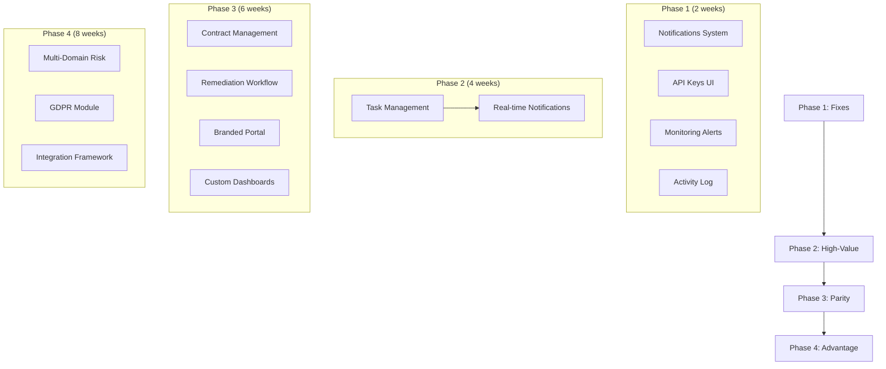

# Competitive Gap Analysis: 3rdRisk vs Our Platform

## Executive Summary

This analysis compares our NIS2 & DORA Compliance Platform against [3rdRisk](https://www.3rdrisk.com/), a leading European TPRM platform trusted by 1,000+ risk professionals. The analysis identifies **23 feature gaps**, **8 broken/incomplete features**, and proposes a **4-phase implementation roadmap**.

**Key Findings:**
- Our platform excels in: NIS2/DORA compliance depth, AI document parsing, questionnaire system
- Gaps exist in: Multi-domain risk, integrations, real-time notifications, task management
- Priority focus: Fix broken features → Add high-value features → Achieve competitive parity

---

## Current Platform Strengths

| Feature | Our Implementation | Competitive Position |
|---------|-------------------|---------------------|
| NIS2 Compliance | Full Article 21 coverage, risk register, heat maps | **Exceeds** 3rdRisk |
| DORA Compliance | Articles 6-44, CTPP oversight, RoI (15 templates) | **Exceeds** 3rdRisk |
| AI Document Parsing | SOC 2, ISO 27001, contracts, pentests via Gemini 2.0 | **Matches** 3rdRisk |
| Vendor Questionnaires | 800+ questions, AI extraction, vendor portal | **Matches** 3rdRisk |
| LEI/GLEIF Integration | Full entity verification, parent hierarchy | **Exceeds** 3rdRisk |
| Incident Reporting | NIS2 Art. 23, DORA Art. 19, 24h/72h tracking | **Exceeds** 3rdRisk |
| Resilience Testing | 10+ test types, TLPT/TIBER-EU | **Matches** 3rdRisk |

---

## Gap Analysis

### Category 1: BROKEN/INCOMPLETE FEATURES (Fix Immediately)

| # | Feature | Current State | Impact | Effort |
|---|---------|--------------|--------|--------|
| 1.1 | **Webhook Retry Logic** | Documented as needing background jobs | Medium | 3 days |
| 1.2 | **Score Dropping Filter** | Function exists, needs `vendor_score_history` data | Low | 1 day |
| 1.3 | **Notifications System** | `notifications` table exists, no UI/triggers | High | 5 days |
| 1.4 | **API Keys Management** | `api_keys` table exists, no UI | Medium | 2 days |
| 1.5 | **Sanctions Screening** | Config route exists, not implemented | Medium | 3 days |
| 1.6 | **Activity Log UI** | Page exists, limited filtering/export | Low | 2 days |
| 1.7 | **Monitoring Alerts UI** | `monitoring_alerts` table exists, no dashboard | Medium | 3 days |
| 1.8 | **Vendor Bulk Export** | Partial - needs XLSX/JSON formats | Low | 1 day |

### Category 2: MISSING HIGH-VALUE FEATURES

| # | Feature | 3rdRisk Has | Our Status | Value | Effort |
|---|---------|------------|------------|-------|--------|
| 2.1 | **Real-time Notifications** | Yes - instant alerts | Table only | Critical | 5 days |
| 2.2 | **Task Management** | Yes - stakeholder tasks | None | High | 7 days |
| 2.3 | **Custom Dashboards** | Yes - customizable | Fixed dashboards | High | 10 days |
| 2.4 | **Contract Management** | Yes - full lifecycle | Basic tracking | High | 7 days |
| 2.5 | **Branded Vendor Portal** | Yes - white-label | No branding | Medium | 3 days |
| 2.6 | **In-App Chat/Chatbot** | Yes - built-in | AI Copilot only | Medium | 5 days |
| 2.7 | **Remediation Workflow** | Yes - issue tracking | Basic gap list | High | 5 days |
| 2.8 | **Vendor Risk Timeline** | Yes - historical view | Score history only | Medium | 3 days |

### Category 3: MISSING COMPETITIVE FEATURES

| # | Feature | 3rdRisk Has | Our Status | Value | Effort |
|---|---------|------------|------------|-------|--------|
| 3.1 | **Multi-Domain Risk** | 6 domains | Security only | Medium | 15 days |
| 3.2 | **ESG/Sustainability** | Yes | None | Medium | 10 days |
| 3.3 | **GDPR Module** | Yes | None | High | 10 days |
| 3.4 | **CSRD Compliance** | Yes | None | Medium | 10 days |
| 3.5 | **Microsoft Teams** | Yes | None | Medium | 5 days |
| 3.6 | **Slack Integration** | Yes | Webhook only | Low | 3 days |
| 3.7 | **40+ Integrations** | Yes | ~5 integrations | Medium | 20 days |
| 3.8 | **Gamification** | Yes | None | Low | 7 days |
| 3.9 | **Financial Risk** | Yes | None | Medium | 7 days |

### Category 4: UX/POLISH FEATURES

| # | Feature | 3rdRisk Has | Our Status | Value | Effort |
|---|---------|------------|------------|-------|--------|
| 4.1 | **Onboarding Tours** | Yes | Basic onboarding | Medium | 3 days |
| 4.2 | **Keyboard Shortcuts** | Unknown | Command palette exists | Low | 2 days |
| 4.3 | **Mobile App** | Unknown | Responsive only | Low | 20 days |
| 4.4 | **Dark Mode** | Unknown | None | Low | 2 days |
| 4.5 | **Multi-language** | Yes (EU) | English only | Medium | 10 days |
| 4.6 | **Report Builder** | Yes | Fixed reports | High | 7 days |

---

## Database Schema Analysis

### Tables Supporting Gaps (Already Exist)

| Table | Status | Gap It Could Support |
|-------|--------|---------------------|
| `notifications` | Empty | 2.1 Real-time Notifications |
| `api_keys` | Empty | 1.4 API Keys Management |
| `monitoring_alerts` | Empty | 1.7 Monitoring Alerts UI |
| `vendor_score_history` | Has data | 1.2 Score Dropping, 2.8 Timeline |
| `activity_log` | Has data | 1.6 Activity Log improvements |
| `webhook_configs` | Empty | 1.1 Webhook improvements |
| `webhook_deliveries` | Empty | 1.1 Webhook retry logic |

### Tables Needed (New)

| Table | Purpose | Related Gap |
|-------|---------|-------------|
| `tasks` | Task management | 2.2 Task Management |
| `task_assignments` | Task stakeholders | 2.2 Task Management |
| `custom_dashboards` | Dashboard configs | 2.3 Custom Dashboards |
| `dashboard_widgets` | Widget definitions | 2.3 Custom Dashboards |
| `contract_renewals` | Renewal tracking | 2.4 Contract Management |
| `contract_clauses` | Clause library | 2.4 Contract Management |
| `remediation_plans` | Remediation tracking | 2.7 Remediation Workflow |
| `remediation_actions` | Action items | 2.7 Remediation Workflow |
| `risk_domains` | Multi-domain risks | 3.1 Multi-Domain Risk |
| `esg_assessments` | ESG data | 3.2 ESG/Sustainability |
| `gdpr_assessments` | GDPR data | 3.3 GDPR Module |
| `integrations` | Integration configs | 3.7 Integrations |
| `integration_syncs` | Sync history | 3.7 Integrations |

---

## Reusable Components Inventory

### UI Components Available for Reuse

| Component | Location | Can Support |
|-----------|----------|-------------|
| `DataTable` | `components/ui/data-table.tsx` | Any list view |
| `StatCard` | `components/ui/stat-card.tsx` | Dashboard widgets |
| `Sparkline` | `components/ui/sparkline.tsx` | Trend indicators |
| `TrendIndicator` | `components/ui/trend-indicator.tsx` | Change displays |
| `HealthScoreGauge` | `components/ui/health-score-gauge.tsx` | Risk gauges |
| `ActionCard` | `components/ui/action-card.tsx` | Task cards |
| `Sheet` | `components/ui/sheet.tsx` | Side panels |
| `Dialog` | `components/ui/dialog.tsx` | Modals |
| `Tabs` | `components/ui/tabs.tsx` | Tab navigation |
| `Calendar` | `components/ui/calendar.tsx` | Date pickers |
| `Progress` | `components/ui/progress.tsx` | Progress bars |
| `Badge` | `components/ui/badge.tsx` | Status badges |
| `CommandPalette` | `components/vendors/vendor-command-palette.tsx` | Keyboard nav |

### Library Modules Available for Reuse

| Module | Location | Can Support |
|--------|----------|-------------|
| `ai/parsers/*` | Document parsing | New document types |
| `compliance/*-calculator.ts` | Score calculation | New frameworks |
| `webhooks/actions.ts` | Webhook delivery | Notifications |
| `exports/pdf-generator.ts` | PDF export | Report builder |
| `exports/xlsx-exporter.ts` | Excel export | Data exports |
| `auth/audit.ts` | Audit logging | Activity tracking |

### Patterns to Follow

| Pattern | Example | Apply To |
|---------|---------|----------|
| Multi-step wizard | `incident-wizard/` | Task creation |
| AI extraction | `nis2-questionnaire/ai/` | New parsers |
| Server actions | `lib/*/actions.ts` | All features |
| Zod validation | `lib/*/schemas.ts` | All forms |
| RLS policies | `migrations/*.sql` | All tables |

---

## Implementation Roadmap

### Phase 1: Fix Broken Features (2 weeks)

**Goal:** Ensure all existing features work correctly

#### Week 1: Core Fixes

| Day | Task | Details |
|-----|------|---------|
| 1-2 | **Notifications System** | Build UI for `notifications` table, add trigger functions |
| 3 | **API Keys UI** | Settings page for API key management |
| 4 | **Monitoring Alerts Dashboard** | Dashboard for `monitoring_alerts` |
| 5 | **Activity Log Improvements** | Better filtering, search, export |

**Migration 034: Notification Triggers**
```sql
-- Trigger notifications on key events
CREATE OR REPLACE FUNCTION notify_on_incident()
RETURNS TRIGGER AS $$
BEGIN
  INSERT INTO notifications (user_id, type, title, message, data)
  SELECT
    p.user_id,
    'incident_created',
    'New Incident Reported',
    'Incident: ' || NEW.title,
    jsonb_build_object('incident_id', NEW.id)
  FROM profiles p
  WHERE p.organization_id = NEW.organization_id;
  RETURN NEW;
END;
$$ LANGUAGE plpgsql;
```

#### Week 2: Polish & Completeness

| Day | Task | Details |
|-----|------|---------|
| 1 | **Score Dropping Data** | Cron job to populate `vendor_score_history` |
| 2 | **Webhook Retry** | Background job setup (pg-boss or similar) |
| 3 | **Bulk Export** | Add XLSX/JSON export formats |
| 4-5 | **Sanctions Screening** | Integrate sanctions API |

### Phase 2: High-Value Features (4 weeks)

**Goal:** Add features that directly impact user value

#### Weeks 3-4: Task Management & Notifications

**Database Schema:**
```sql
-- Migration 035: Task Management
CREATE TYPE task_status AS ENUM ('pending', 'in_progress', 'completed', 'blocked', 'cancelled');
CREATE TYPE task_priority AS ENUM ('critical', 'high', 'medium', 'low');

CREATE TABLE tasks (
  id UUID PRIMARY KEY DEFAULT gen_random_uuid(),
  organization_id UUID NOT NULL REFERENCES organizations(id),
  title TEXT NOT NULL,
  description TEXT,
  status task_status DEFAULT 'pending',
  priority task_priority DEFAULT 'medium',
  due_date TIMESTAMPTZ,

  -- Polymorphic association
  related_type TEXT, -- 'vendor', 'incident', 'questionnaire', 'document'
  related_id UUID,

  -- Assignment
  assigned_to UUID REFERENCES profiles(user_id),
  created_by UUID REFERENCES profiles(user_id),

  -- Metadata
  metadata JSONB DEFAULT '{}',
  created_at TIMESTAMPTZ DEFAULT NOW(),
  updated_at TIMESTAMPTZ DEFAULT NOW(),
  completed_at TIMESTAMPTZ
);

CREATE TABLE task_comments (
  id UUID PRIMARY KEY DEFAULT gen_random_uuid(),
  task_id UUID NOT NULL REFERENCES tasks(id) ON DELETE CASCADE,
  user_id UUID NOT NULL REFERENCES profiles(user_id),
  content TEXT NOT NULL,
  created_at TIMESTAMPTZ DEFAULT NOW()
);

-- Enable RLS
ALTER TABLE tasks ENABLE ROW LEVEL SECURITY;
CREATE POLICY "Users can manage org tasks" ON tasks
  FOR ALL TO authenticated
  USING (organization_id = public.get_user_organization_id());
```

**UI Components:**
- `components/tasks/task-list.tsx` - Task list with filters
- `components/tasks/task-card.tsx` - Individual task card
- `components/tasks/task-detail-sheet.tsx` - Side panel for task details
- `components/tasks/create-task-dialog.tsx` - Task creation modal
- `components/tasks/task-filters.tsx` - Filter controls

**Pages:**
- `/tasks` - Task dashboard
- `/tasks/my-tasks` - Assigned to current user
- `/tasks/all` - All organization tasks

#### Weeks 5-6: Real-time Notifications & Alerts

**Components:**
- `components/notifications/notification-bell.tsx` - Header bell icon
- `components/notifications/notification-dropdown.tsx` - Dropdown list
- `components/notifications/notification-settings.tsx` - Preferences
- `components/notifications/notification-toast.tsx` - Toast alerts

**Notification Types:**
```typescript
type NotificationType =
  | 'incident_created'
  | 'incident_updated'
  | 'questionnaire_submitted'
  | 'questionnaire_approved'
  | 'document_parsed'
  | 'vendor_risk_change'
  | 'contract_expiring'
  | 'task_assigned'
  | 'task_due_soon'
  | 'compliance_deadline'
  | 'monitoring_alert';
```

### Phase 3: Competitive Parity (6 weeks)

**Goal:** Match 3rdRisk's core competitive features

#### Weeks 7-8: Contract Management Enhancement

**Current State:** Basic `contracts` table with dates
**Target State:** Full contract lifecycle management

**New Tables:**
```sql
-- Migration 036: Enhanced Contracts
CREATE TABLE contract_clauses (
  id UUID PRIMARY KEY DEFAULT gen_random_uuid(),
  contract_id UUID NOT NULL REFERENCES contracts(id) ON DELETE CASCADE,
  clause_type TEXT NOT NULL, -- 'termination', 'sla', 'liability', 'data_protection', etc.
  title TEXT NOT NULL,
  content TEXT,
  ai_extracted BOOLEAN DEFAULT false,
  ai_confidence FLOAT,
  flagged BOOLEAN DEFAULT false,
  flag_reason TEXT,
  created_at TIMESTAMPTZ DEFAULT NOW()
);

CREATE TABLE contract_renewals (
  id UUID PRIMARY KEY DEFAULT gen_random_uuid(),
  contract_id UUID NOT NULL REFERENCES contracts(id) ON DELETE CASCADE,
  renewal_date DATE NOT NULL,
  new_end_date DATE,
  status TEXT DEFAULT 'pending', -- 'pending', 'approved', 'rejected', 'auto_renewed'
  notes TEXT,
  approved_by UUID REFERENCES profiles(user_id),
  created_at TIMESTAMPTZ DEFAULT NOW()
);

CREATE TABLE contract_alerts (
  id UUID PRIMARY KEY DEFAULT gen_random_uuid(),
  contract_id UUID NOT NULL REFERENCES contracts(id) ON DELETE CASCADE,
  alert_type TEXT NOT NULL, -- 'expiry_30d', 'expiry_90d', 'renewal_due', 'clause_issue'
  triggered_at TIMESTAMPTZ DEFAULT NOW(),
  acknowledged_at TIMESTAMPTZ,
  acknowledged_by UUID REFERENCES profiles(user_id)
);
```

**Features:**
- Contract renewal workflow
- Clause library with AI extraction
- Expiry calendar view
- Contract comparison
- Bulk renewal processing

#### Weeks 9-10: Remediation Workflow

**Current State:** Gap list in `vendor_gap_analysis`
**Target State:** Full remediation tracking with plans, actions, deadlines

**New Tables:**
```sql
-- Migration 037: Remediation Workflow
CREATE TYPE remediation_status AS ENUM (
  'identified', 'planned', 'in_progress', 'pending_verification', 'completed', 'accepted_risk'
);

CREATE TABLE remediation_plans (
  id UUID PRIMARY KEY DEFAULT gen_random_uuid(),
  organization_id UUID NOT NULL REFERENCES organizations(id),
  vendor_id UUID REFERENCES vendors(id),
  title TEXT NOT NULL,
  description TEXT,
  framework TEXT, -- 'nis2', 'dora', 'iso27001'

  -- Scope
  gap_ids UUID[], -- References to gaps being addressed
  control_ids UUID[], -- Controls being remediated

  -- Timeline
  target_date DATE,
  status remediation_status DEFAULT 'identified',

  -- Ownership
  owner_id UUID REFERENCES profiles(user_id),

  created_at TIMESTAMPTZ DEFAULT NOW(),
  updated_at TIMESTAMPTZ DEFAULT NOW()
);

CREATE TABLE remediation_actions (
  id UUID PRIMARY KEY DEFAULT gen_random_uuid(),
  plan_id UUID NOT NULL REFERENCES remediation_plans(id) ON DELETE CASCADE,
  title TEXT NOT NULL,
  description TEXT,
  status remediation_status DEFAULT 'identified',
  assigned_to UUID REFERENCES profiles(user_id),
  due_date DATE,
  completed_at TIMESTAMPTZ,
  evidence_ids UUID[], -- Links to evidence documents

  created_at TIMESTAMPTZ DEFAULT NOW(),
  updated_at TIMESTAMPTZ DEFAULT NOW()
);
```

**UI:**
- Remediation dashboard with Kanban view
- Plan creation wizard
- Action tracking
- Evidence linking
- Progress reporting

#### Weeks 11-12: Branded Vendor Portal & Custom Dashboards

**Branded Portal:**
```typescript
// Organization branding settings
interface OrganizationBranding {
  logo_url: string;
  primary_color: string;
  secondary_color: string;
  portal_welcome_message: string;
  portal_footer_text: string;
  custom_css?: string;
}
```

**Custom Dashboards:**
```sql
-- Migration 038: Custom Dashboards
CREATE TABLE custom_dashboards (
  id UUID PRIMARY KEY DEFAULT gen_random_uuid(),
  organization_id UUID NOT NULL REFERENCES organizations(id),
  name TEXT NOT NULL,
  description TEXT,
  is_default BOOLEAN DEFAULT false,
  layout JSONB NOT NULL, -- Widget positions and sizes
  created_by UUID REFERENCES profiles(user_id),
  created_at TIMESTAMPTZ DEFAULT NOW(),
  updated_at TIMESTAMPTZ DEFAULT NOW()
);

CREATE TABLE dashboard_widgets (
  id UUID PRIMARY KEY DEFAULT gen_random_uuid(),
  dashboard_id UUID NOT NULL REFERENCES custom_dashboards(id) ON DELETE CASCADE,
  widget_type TEXT NOT NULL, -- 'stat_card', 'chart', 'table', 'list', 'calendar'
  title TEXT NOT NULL,
  config JSONB NOT NULL, -- Widget-specific configuration
  position JSONB NOT NULL, -- {x, y, w, h}
  created_at TIMESTAMPTZ DEFAULT NOW()
);
```

### Phase 4: Competitive Advantage (8 weeks)

**Goal:** Exceed 3rdRisk with unique capabilities

#### Weeks 13-16: Multi-Domain Risk & ESG

**Expand risk domains beyond cybersecurity:**
- Operational Risk
- Financial Risk
- ESG/Sustainability
- Business Continuity
- Privacy/GDPR
- Legal/Contractual

**New Tables:**
```sql
-- Migration 039: Multi-Domain Risk
CREATE TYPE risk_domain AS ENUM (
  'cybersecurity', 'operational', 'financial', 'esg',
  'business_continuity', 'privacy', 'legal'
);

CREATE TABLE vendor_domain_assessments (
  id UUID PRIMARY KEY DEFAULT gen_random_uuid(),
  vendor_id UUID NOT NULL REFERENCES vendors(id),
  domain risk_domain NOT NULL,
  assessment_date DATE NOT NULL,
  score INTEGER CHECK (score >= 0 AND score <= 100),
  grade TEXT, -- A, B, C, D, F
  assessor_id UUID REFERENCES profiles(user_id),

  -- Domain-specific data
  data JSONB DEFAULT '{}',

  created_at TIMESTAMPTZ DEFAULT NOW(),

  UNIQUE(vendor_id, domain, assessment_date)
);

-- ESG-specific tables
CREATE TABLE esg_metrics (
  id UUID PRIMARY KEY DEFAULT gen_random_uuid(),
  vendor_id UUID NOT NULL REFERENCES vendors(id),

  -- Environmental
  carbon_footprint FLOAT,
  renewable_energy_percent FLOAT,
  waste_management_score INTEGER,

  -- Social
  diversity_score INTEGER,
  labor_practices_score INTEGER,
  community_impact_score INTEGER,

  -- Governance
  board_independence_percent FLOAT,
  ethics_policy_exists BOOLEAN,
  whistleblower_policy_exists BOOLEAN,

  assessment_date DATE NOT NULL,
  source TEXT, -- 'self_reported', 'third_party', 'public_data'

  created_at TIMESTAMPTZ DEFAULT NOW()
);
```

#### Weeks 17-18: GDPR Compliance Module

**Features:**
- Data processing inventory
- Legal basis tracking
- DPIA (Data Protection Impact Assessment)
- Data subject rights management
- Processor agreements tracking

**New Tables:**
```sql
-- Migration 040: GDPR Module
CREATE TABLE gdpr_processing_activities (
  id UUID PRIMARY KEY DEFAULT gen_random_uuid(),
  organization_id UUID NOT NULL REFERENCES organizations(id),
  vendor_id UUID REFERENCES vendors(id),

  activity_name TEXT NOT NULL,
  purpose TEXT NOT NULL,
  legal_basis TEXT NOT NULL, -- consent, contract, legal_obligation, etc.
  data_categories TEXT[], -- personal, sensitive, children, etc.
  data_subjects TEXT[], -- employees, customers, etc.
  recipients TEXT[],
  transfers_outside_eu BOOLEAN DEFAULT false,
  transfer_safeguards TEXT,
  retention_period TEXT,

  created_at TIMESTAMPTZ DEFAULT NOW(),
  updated_at TIMESTAMPTZ DEFAULT NOW()
);

CREATE TABLE gdpr_dpias (
  id UUID PRIMARY KEY DEFAULT gen_random_uuid(),
  organization_id UUID NOT NULL REFERENCES organizations(id),
  processing_activity_id UUID REFERENCES gdpr_processing_activities(id),

  title TEXT NOT NULL,
  status TEXT DEFAULT 'draft', -- draft, in_review, approved, rejected
  risk_level TEXT, -- low, medium, high

  -- DPIA sections
  necessity_assessment JSONB,
  risk_assessment JSONB,
  mitigation_measures JSONB,
  dpo_opinion TEXT,

  approved_by UUID REFERENCES profiles(user_id),
  approved_at TIMESTAMPTZ,

  created_at TIMESTAMPTZ DEFAULT NOW(),
  updated_at TIMESTAMPTZ DEFAULT NOW()
);
```

#### Weeks 19-20: Integration Framework

**Build integration framework for 20+ integrations:**

```sql
-- Migration 041: Integrations Framework
CREATE TABLE integrations (
  id UUID PRIMARY KEY DEFAULT gen_random_uuid(),
  organization_id UUID NOT NULL REFERENCES organizations(id),

  provider TEXT NOT NULL, -- 'slack', 'teams', 'jira', 'servicenow', etc.
  name TEXT NOT NULL,
  status TEXT DEFAULT 'inactive', -- inactive, active, error

  -- OAuth credentials (encrypted)
  credentials JSONB,

  -- Configuration
  config JSONB DEFAULT '{}',

  -- Sync settings
  sync_enabled BOOLEAN DEFAULT true,
  sync_interval_minutes INTEGER DEFAULT 60,
  last_sync_at TIMESTAMPTZ,
  last_sync_status TEXT,
  last_sync_error TEXT,

  created_at TIMESTAMPTZ DEFAULT NOW(),
  updated_at TIMESTAMPTZ DEFAULT NOW()
);

CREATE TABLE integration_events (
  id UUID PRIMARY KEY DEFAULT gen_random_uuid(),
  integration_id UUID NOT NULL REFERENCES integrations(id) ON DELETE CASCADE,
  event_type TEXT NOT NULL, -- 'sync', 'webhook', 'action'
  direction TEXT NOT NULL, -- 'inbound', 'outbound'
  payload JSONB,
  response JSONB,
  status TEXT, -- success, error
  error_message TEXT,
  created_at TIMESTAMPTZ DEFAULT NOW()
);
```

**Priority Integrations:**
1. Slack (notifications, commands)
2. Microsoft Teams (notifications, tabs)
3. Jira (task sync, issue creation)
4. ServiceNow (incident sync)
5. Okta/Azure AD (SSO, user sync)
6. BitSight/SecurityScorecard (risk ratings)
7. OneTrust (privacy management)
8. SAP Ariba (procurement)

---

## Implementation Dependencies



---

## Success Metrics

| Phase | Metric | Target |
|-------|--------|--------|
| Phase 1 | All broken features fixed | 100% |
| Phase 1 | User-reported bugs | < 5 |
| Phase 2 | Task completion rate | > 80% |
| Phase 2 | Notification engagement | > 60% |
| Phase 3 | Contract renewal tracking | 100% vendors |
| Phase 3 | Remediation plan adoption | > 50% gaps |
| Phase 4 | Multi-domain assessments | > 30% vendors |
| Phase 4 | Integration activations | > 3 per org |

---

## Risk Assessment

| Risk | Likelihood | Impact | Mitigation |
|------|------------|--------|------------|
| Scope creep | High | High | Strict phase gates |
| Database migration issues | Medium | High | Test on branches first |
| UI complexity | Medium | Medium | Reuse existing components |
| Integration API changes | Medium | Medium | Abstract integration layer |
| Performance degradation | Low | High | Add indexes, optimize queries |

---

## Conclusion

This implementation plan addresses all identified gaps while building on our existing strengths. By following the phased approach, we can:

1. **Week 1-2:** Fix all broken features (immediate value)
2. **Week 3-6:** Add task management and notifications (high user impact)
3. **Week 7-12:** Achieve competitive parity with 3rdRisk
4. **Week 13-20:** Create competitive advantages

Total estimated timeline: **20 weeks** (5 months)

---

## Appendix: File Structure for New Features

```
src/
├── app/(dashboard)/
│   ├── tasks/
│   │   ├── page.tsx
│   │   ├── my-tasks/page.tsx
│   │   └── [taskId]/page.tsx
│   ├── contracts/
│   │   ├── page.tsx
│   │   ├── calendar/page.tsx
│   │   └── [contractId]/page.tsx
│   ├── remediation/
│   │   ├── page.tsx
│   │   └── [planId]/page.tsx
│   ├── gdpr/
│   │   ├── page.tsx
│   │   ├── processing-activities/page.tsx
│   │   └── dpias/page.tsx
│   └── integrations/
│       ├── page.tsx
│       └── [provider]/page.tsx
├── components/
│   ├── tasks/
│   ├── contracts/
│   ├── remediation/
│   ├── gdpr/
│   ├── notifications/
│   └── integrations/
└── lib/
    ├── tasks/
    ├── contracts/
    ├── remediation/
    ├── gdpr/
    ├── notifications/
    └── integrations/
```

---

*Generated: January 23, 2026*
*Sources: [3rdRisk Platform](https://www.3rdrisk.com/platform), [3rdRisk AI Features](https://www.3rdrisk.com/news/third-party-risk-platform-ai)*
